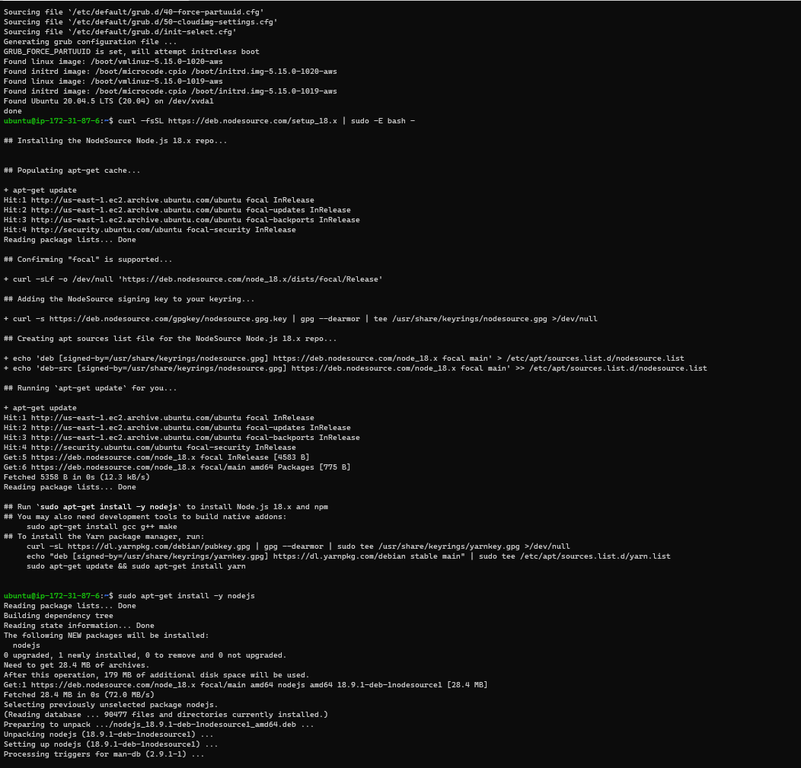
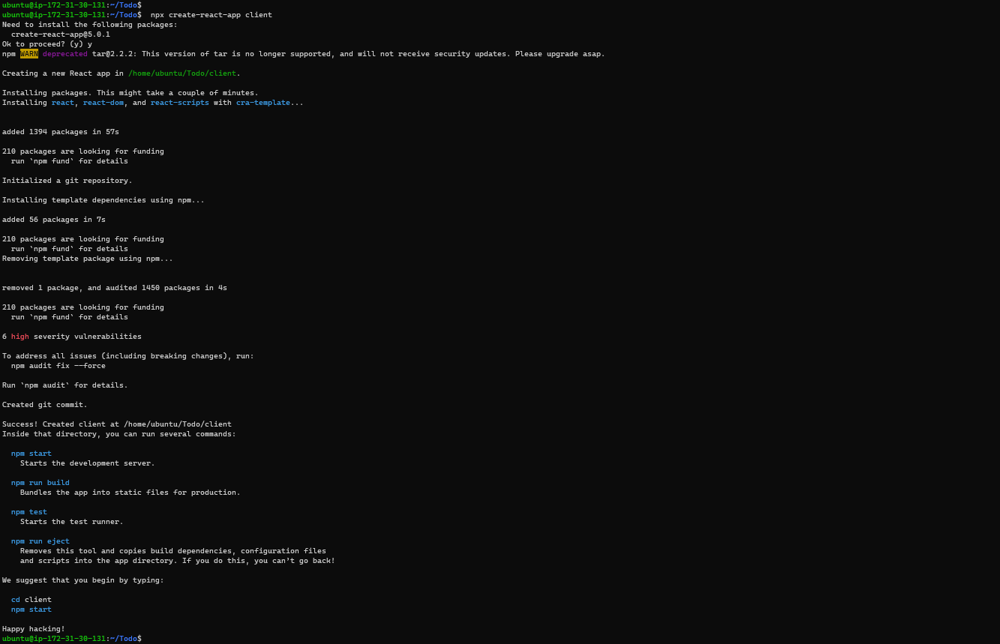

## **PROJECT 3**

### **STEP 0: Preparing Prerequisites**

In project 3, The task is to implement a web solution based on MERN stack in AWS Cloud which consists of following components;

1. MongoDB
2. EpressJs
3. ReactJs
4. Node.js

On the AWS account, create a new EC2 Instance of t2.micro family with Ubuntu Server 20.04 LTS (HVM) image. When you create your EC2 Instances, you can add Tag "Name" to it with a value that corresponds to a current project you are working on – it will be reflected in the name of the EC2 Instance.

Task :
To deploy a simple To-Do application that creates To-Do lists.

### **STEP 1: Back End Configuration**

Installing node and creating a current directory Todo

`sudo apt update`

`sudo apt upgrade`

`curl -fsSL https://deb.nodesource.com/setup_18.x | sudo -E bash -`

`sudo apt-get install -y nodejs`

`mkdir Todo `

`cd Todo `

`ls`

`npm init `

installing ExpressJs and creating cd route

`npm install express`

`touch index.js`

`npm install dotenv`

`vim index.js`

Now it is time to start our server to see if it works

`node index.js`

`http://<PublicIP-or-PublicDNS>:5000`

Routes

There are three actions that our To-Do application needs to be able to do:

1. Create a new task
2. Display list of all tasks
3. Delete a completed task

`mkdir routes`

Change directory to routes folder

`cd routes `

`touch api.js`

`vim api.js`

models

Change directory back Todo folder with cd .. and install Mongoose

`npm install mongoose`

`mkdir models`

`cd models`

`touch todo.js`

The next piece of our application will be the MongoDB Database

MongoDB Database:

A database where we will store our data is needed. Making use of mLab. mLab provides MongoDB database as a service solution (DBaaS).
Follow the sign up process, select AWS as the cloud provider, and choose a region near you.

In the index.js file, we specified process.env to access environment variables, but we have not yet created this file. So we need to do that now.

Enter the Todo directory and create a .env file

`touch .env`

`vi .env`

add the connection string to access the data base

`DB = 'mongodb+srv://<username>:<password>@<network-address>/<dbname>?retryWrites=true&w=majority'`

Ensure to update username:password:network-address and :database according to your setup

Now we need to update the index.js to reflect the use of .env so that Node.js can connect to the database.

`vim index.js`

Start your server using the command:

`node index.js`

and you can kill the server with

`pkill node`

the backend part of our To-Do application is ready, and configured a database, but we do not have a frontend UI yet. We need ReactJS code to achieve that. But during development, we will need a way to test our code using RESTfulL API. Therefore, we will need to make use of some API development client(postman) to test our code.

Now open your Postman, create a POST request to the API http://PublicIP-or-PublicDNS:5000/api/todos.  
This request sends a new task to our To-Do list so the application could store it in the database.

### **STEP 2: Front End Creation**

we need to create a user interface for a Web client (browser) to interact with the application via API. To start out with the frontend of the To-do app, we will use the create-react-app command to scaffold our app

In the same root directory as your backend code, which is the Todo directory, run:

` npx create-react-app client`

1. Install concurrently. It is used to run more than one command simultaneously from the same terminal window.

`npm install concurrently --save-dev`

2. Install nodemon. It is used to run and monitor the server. If there is any change in the server code, nodemon will restart it automatically and load the new changes.

`npm install nodemon --save-dev`

3. In Todo folder open the package.json file. Change the highlighted part of the below screenshot and replace with the code below.

Configure Proxy in package.json in the client folder

`cd client`

`vi package.json`

Add the key value pair in the package.json file `"proxy": "http://localhost:5000"`

The whole purpose of adding the proxy configuration in number 3 above is to make it possible to access the application directly from the browser by simply calling the server url like `http://localhost:5000` rather than always including the entire path like `http://localhost:5000/api/todos`

Now, ensure you are inside the Todo directory, and run:

`npm run dev`

your app should open and start running on localhost:3000

**Creating your React Components**

From the todo directory run

`cd client`

`cd src`

`mkdir components`

`cd components`

Inside ‘components’ directory create three files Input.js, ListTodo.js and Todo.js.

`touch Input.js ListTodo.js Todo.js`

Open Input.js file and input tne code below

To make use of Axios, which is a Promise based HTTP client for the browser and node.js, you need to cd into your client from your terminal and run yarn add axios or npm install axios.

`cd ..`

`cd ..`

`npm install axios`

Go back into the components Directory

`cd src/components`

`vi ListTodo.js`

input the code below

Then in your Todo.js file you write the following code

import React, {Component} from 'react';
import axios from 'axios';

import Input from './Input';
import ListTodo from './ListTodo';

class Todo extends Component {

state = {
todos: []
}

componentDidMount(){
this.getTodos();
}

getTodos = () => {
axios.get('/api/todos')
.then(res => {
if(res.data){
this.setState({
todos: res.data
})
}
})
.catch(err => console.log(err))
}

deleteTodo = (id) => {

    axios.delete(`/api/todos/${id}`)
      .then(res => {
        if(res.data){
          this.getTodos()
        }
      })
      .catch(err => console.log(err))

}

render() {
let { todos } = this.state;

    return(
      

        <h1>My Todo(s)</h1>
        <Input getTodos={this.getTodos}/>
        <ListTodo todos={todos} deleteTodo={this.deleteTodo}/>
      

    )

}
}

export default Todo;

**Move to the src folder**

`cd ..`

`vi App.js`

Copy and paste the code below into it

import React from 'react';

import Todo from './components/Todo';
import './App.css';

const App = () => {
return (

<Todo />

);
}

export default App;

**In the src directory open the App.css**

run:

`vi App.css`

.App {
text-align: center;
font-size: calc(10px + 2vmin);
width: 60%;
margin-left: auto;
margin-right: auto;
}

input {
height: 40px;
width: 50%;
border: none;
border-bottom: 2px #101113 solid;
background: none;
font-size: 1.5rem;
color: #787a80;
}

input:focus {
outline: none;
}

button {
width: 25%;
height: 45px;
border: none;
margin-left: 10px;
font-size: 25px;
background: #101113;
border-radius: 5px;
color: #787a80;
cursor: pointer;
}

button:focus {
outline: none;
}

ul {
list-style: none;
text-align: left;
padding: 15px;
background: #171a1f;
border-radius: 5px;
}

li {
padding: 15px;
font-size: 1.5rem;
margin-bottom: 15px;
background: #282c34;
border-radius: 5px;
overflow-wrap: break-word;
cursor: pointer;
}

@media only screen and (min-width: 300px) {
.App {
width: 80%;
}

input {
width: 100%
}

button {
width: 100%;
margin-top: 15px;
margin-left: 0;
}
}

@media only screen and (min-width: 640px) {
.App {
width: 60%;
}

input {
width: 50%;
}

button {
width: 30%;
margin-left: 10px;
margin-top: 0;
}
}

**In the src directory open the index.css**

`vim index.css`

paste the code below

body {
margin: 0;
padding: 0;
font-family: -apple-system, BlinkMacSystemFont, "Segoe UI", "Roboto", "Oxygen",
"Ubuntu", "Cantarell", "Fira Sans", "Droid Sans", "Helvetica Neue",
sans-serif;
-webkit-font-smoothing: antialiased;
-moz-osx-font-smoothing: grayscale;
box-sizing: border-box;
background-color: #282c34;
color: #787a80;
}

code {
font-family: source-code-pro, Menlo, Monaco, Consolas, "Courier New",
monospace;
}

**Go to the Todo directory**

`cd ../..`

run:

`npm run dev`

then run on the browser using the public key and port :3000

